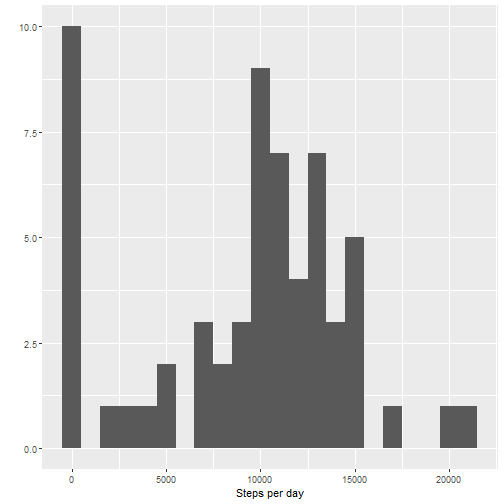
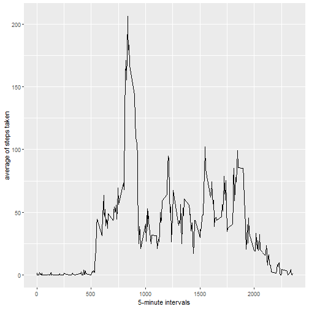
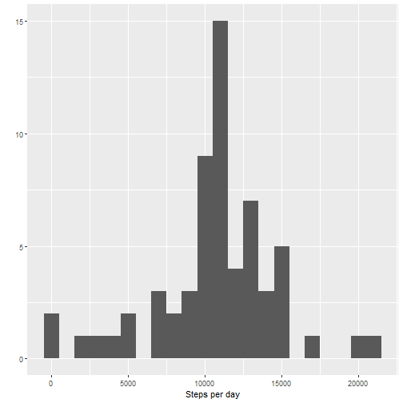
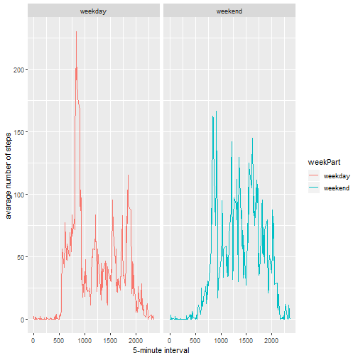

Activity Data Analysis
======================

Unzipping the data and loading it, also change date column

```r
unzip('activity.zip')
data <- read.csv('activity.csv')
data$date <- as.Date(data$date , format = "%Y-%m-%d")
```

Histogram of the total number of steps taken each day

```r
stepsByDay <- tapply(data$steps, data$date, sum, na.rm=TRUE)
library(ggplot2)
qplot(stepsByDay, xlab = "Steps per day", binwidth = 1000)
```



Mean and median total number of steps taken per day

```r
mean(stepsByDay)
```

```
## [1] 9354.23
```

```r
median(stepsByDay)
```

```
## [1] 10395
```

Average daily activity pattern

```r
averageStepsPerTimeInterval <- aggregate(x=list(meanSteps=data$steps), by=list(interval=data$interval), FUN=mean, na.rm=TRUE)
ggplot(data=averageStepsPerTimeInterval, aes(x=interval, y=meanSteps)) + geom_line() + xlab("5-minute intervals") + ylab("average of steps taken")
```



Which 5-minute interval, on average across all the days in the dataset, contains the maximum number of steps?

```r
indexOfMaxMeanSteps <- which.max(averageStepsPerTimeInterval$meanSteps)
timeOfMaxMeanSteps <- averageStepsPerTimeInterval[indexOfMaxMeanSteps,'interval']
timeOfMaxMeanSteps <- as.character(timeOfMaxMeanSteps)
h <- substr(timeOfMaxMeanSteps, start = 1, stop = (nchar(timeOfMaxMeanSteps) -2))
m <- substr(timeOfMaxMeanSteps, start = (nchar(timeOfMaxMeanSteps) - 1), stop = (nchar(timeOfMaxMeanSteps)))
paste(h, m, sep = ":")
```

```
## [1] "8:35"
```

Imputing missing values

total number of missing values in the dataset And imputing with the interval average

```r
sum(is.na(data$steps))
```

```
## [1] 2304
```

```r
nas <- is.na(data$steps)
avg_interval <- tapply(data$steps, data$interval, mean, na.rm=TRUE, simplify=TRUE)
data$steps[nas] <- avg_interval[as.character(data$interval[nas])]
```

Checking if there is still NA's

```r
sum(is.na(data$steps))
```

```
## [1] 0
```


Histogram of the total number of steps taken each day wihtout NA's

```r
stepsByDayNoNA <- tapply(data$steps, data$date, sum, na.rm=TRUE)
qplot(stepsByDayNoNA, xlab = "Steps per day", binwidth = 1000)
```



Mean and median total number of steps taken per day without NA's

```r
mean(stepsByDayNoNA)
```

```
## [1] 10766.19
```

```r
median(stepsByDayNoNA)
```

```
## [1] 10766.19
```

The impact of imputing missing data with the average number of steps in the same 5-min interval is that both the mean and the median are equal to the same value: 10766.19
And also the histogram has changed.

Are there differences in activity patterns between weekdays and weekends?

```r
data <- cbind(data, weekPart = ifelse(weekdays(data$date) == "Saturday" | weekdays(data$date) == "Sunday", "weekend", "weekday"))
data$weekPart <- as.factor(data$weekPart)

averagedActivityDataWeekPart <- aggregate(steps ~ interval + weekPart, data=data, mean)
ggplot(averagedActivityDataWeekPart, aes(x=interval, y=steps, color=weekPart)) + 
    geom_line() + 
    facet_grid(~weekPart) +
    xlab("5-minute interval") + 
    ylab("avarage number of steps")
```



We can see that the person is more active earlier in the day during weekdays compared to weekends, but more active throughout the weekends compared with weekdays.
